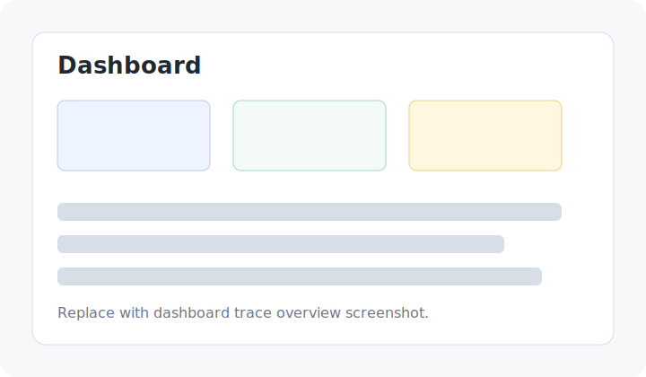
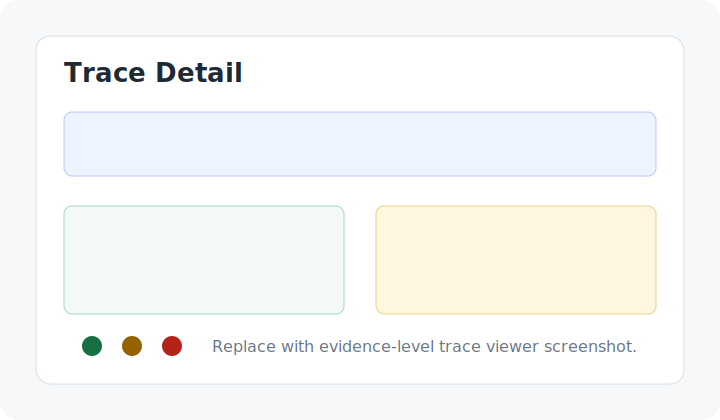
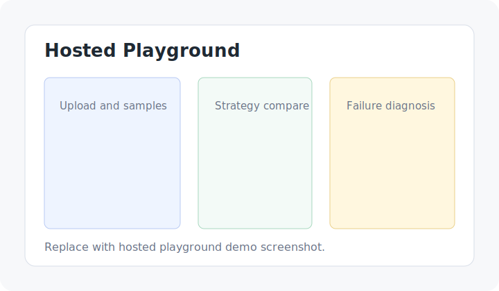
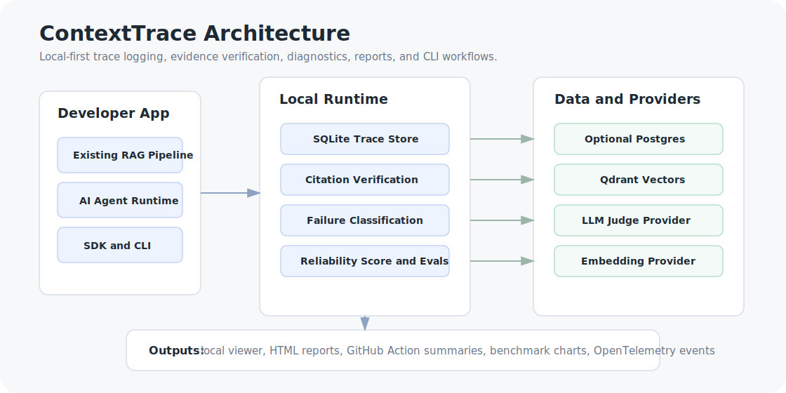

# ContextTrace

[](https://pypi.org/project/contexttrace/)
[](https://github.com/samarth1412/Context-Trace/actions/workflows/ci.yml)
[](#tests)
[](LICENSE)
[](packages/contexttrace/pyproject.toml)

ContextTrace is an SDK-first reliability layer for RAG and agent applications. It traces the evidence path behind an answer, verifies whether citations support answer claims, classifies failure modes, and produces reports that tell developers what to fix next.

It is not a generic observability clone and not a RAG chatbot. ContextTrace focuses on the parts of RAG systems that fail quietly: retrieval, context selection, citations, unsupported claims, policy decisions, and agent memory/tool use.

## Why RAG Fails Silently

RAG applications often look correct until a user checks the evidence. Common failure modes include:

- the retriever misses the one chunk that matters
- the answer cites a chunk that does not support the claim
- context compression drops the key sentence
- conflicting sources are merged into one confident answer
- the system should abstain but answers anyway
- agents call stale memory or the wrong tool

ContextTrace makes those failures inspectable at the trace, project, batch eval, and report level.

## What ContextTrace Shows

- Query and metadata
- Retrieved chunks, selected context, and dropped context
- Answer, citations, token usage, cost, and latency
- Citation support verdicts and rationale
- RAG failure type, severity, root cause, and suggested fix
- Practical reliability score with strengths, weaknesses, and recommendations
- Context policy decisions and retrieval strategy comparisons
- Agent timeline events for planner steps, tools, memory, and errors

## Quickstart

Install the SDK:

```bash
pip install contexttrace
contexttrace --version
contexttrace init
```

Trace one RAG request in local mode:

```python
from contexttrace import ContextTrace

ct = ContextTrace(mode="local", project="support-rag")

with ct.trace(query="What is the refund policy?") as trace:
    chunks = retriever.search("What is the refund policy?")
    trace.log_retrieval(chunks)
    trace.log_context(chunks[:5])

    answer = llm.generate("What is the refund policy?", chunks[:5])
    trace.log_answer(answer, model="gpt-4.1-mini", usage={"total_tokens": 1200})

    trace.log_citations([
        {"claim": "Refunds are available within 30 days.", "source_chunk_id": "chunk_12"}
    ])

    result = trace.evaluate()
    trace.export_report("report.html")
```

Open the local report:

```bash
contexttrace trace list
contexttrace report --last --output report.html
```

Hosted/API mode uses the same SDK surface:

```python
ct = ContextTrace(
    api_key="ctx_test",
    project="support-rag",
    base_url="http://localhost:8000",
)
```

## SDK Example

```python
from contexttrace import ContextTrace

ct = ContextTrace(api_key="ctx_test", project="support-rag")

with ct.trace(query="Can final-sale items be refunded?", metadata={"env": "prod"}) as trace:
    retrieved = retriever.search(trace.query)
    trace.log_retrieval(retrieved, retriever_name="hybrid-reranker")

    selected = retrieved[:4]
    trace.log_context(selected)

    answer = llm.generate(trace.query, selected)
    trace.log_answer(
        answer,
        model="gpt-4.1-mini",
        usage={"prompt_tokens": 900, "completion_tokens": 140, "total_tokens": 1040},
    )

    trace.log_citations([
        {"claim": "Final-sale items can be refunded within 30 days.", "source_chunk_id": "policy_7"}
    ])

    evaluation = trace.evaluate()
```

Example evaluation shape:

```json
{
  "scores": {
    "citation_support": 0.1,
    "unsupported_claim_rate": 1.0
  },
  "reliability": {
    "score": 24,
    "grade": "F",
    "weaknesses": ["Citation support is weak across evaluated claims."],
    "recommendations": ["Add claim-level citation checks before returning answers."]
  },
  "failure": {
    "failure_type": "citation_mismatch",
    "severity": "medium",
    "root_cause": "The cited source does not support the refund timing claim.",
    "suggested_fix": "Require sentence-level citation checks for timing claims."
  }
}
```

## Dashboard Screenshots

The dashboard is a developer tool for scanning trace quality, drilling into evidence, and comparing RAG strategies.

| Dashboard | Trace Detail | Playground |
| --- | --- | --- |
|  |  |  |

Demo GIF placeholders are tracked under [docs/assets/demo-gifs](docs/assets/demo-gifs/README.md):

- SDK trace
- Dashboard trace viewer
- Citation verifier
- Strategy comparison
- HTML report export

## Failure Taxonomy

ContextTrace classifies failures into actionable labels:

```text
no_failure_detected
retrieval_miss
low_relevance_context
citation_mismatch
unsupported_answer
contradicted_answer
conflicting_sources
bad_chunking
over_compression
should_have_abstained
query_needs_decomposition
wrong_tool_used
tool_error
stale_memory_used
missing_memory
excessive_tool_calls
agent_loop_detected
unknown
```

Each failure report includes severity, root cause, and a suggested fix. See [docs/failure_taxonomy.md](docs/failure_taxonomy.md).

## Citation Verification

Citation verification checks each answer claim against the cited chunk text and returns structured JSON:

```json
{
  "claim": "Refunds are processed in two days.",
  "source_chunk_id": "refund_policy#chunk_2",
  "verdict": "unsupported",
  "support_score": 0.1,
  "reason": "The cited source says processing time varies by bank."
}
```

Supported verdicts:

```text
directly_supported
partially_supported
unsupported
contradicted
not_enough_info
```

The backend uses a provider abstraction for LLM judges. Business logic does not hardcode OpenAI calls. See [docs/citation_verification.md](docs/citation_verification.md).

## Integrations

### LangChain

```python
from contexttrace import ContextTraceCallbackHandler

handler = ContextTraceCallbackHandler(
    api_key="ctx_test",
    project="support-rag",
    base_url="http://localhost:8000",
)

result = chain.invoke(
    {"query": "What is the refund policy?"},
    config={"callbacks": [handler]},
)
```

See [examples/langchain_rag.py](examples/langchain_rag.py) and [docs/integrations/langchain.md](docs/integrations/langchain.md).

### LlamaIndex

```python
from contexttrace import ContextTraceLlamaIndexCallbackHandler
from llama_index.core import Settings
from llama_index.core.callbacks import CallbackManager

handler = ContextTraceLlamaIndexCallbackHandler(api_key="ctx_test", project="support-rag")
Settings.callback_manager = CallbackManager([handler])

response = query_engine.query("What is the refund policy?")
```

See [examples/llamaindex_rag.py](examples/llamaindex_rag.py) and [docs/integrations/llamaindex.md](docs/integrations/llamaindex.md).

Other integrations:

- [FastAPI middleware](docs/integrations/fastapi.md)
- [LangGraph beta](docs/integrations/langgraph.md)
- [OpenTelemetry export](packages/contexttrace/contexttrace/integrations/opentelemetry.py)

## Benchmark Results

ContextTrace includes a reproducible local benchmark pipeline for comparing retrieval strategies.

```bash
python benchmarks/run_benchmark.py --dataset benchmarks/datasets/refund_policy
```

Current sample `refund_policy` results:

| Strategy | Citation Support | Unsupported Claim Rate | Failure Rate | Avg Latency |
| --- | ---: | ---: | ---: | ---: |
| `contexttrace_adaptive` | 0.914 | 0.058 | 0.000 | 636.0 ms |
| `hybrid_rerank` | 0.888 | 0.092 | 0.000 | 539.5 ms |
| `corrective_rag` | 0.864 | 0.136 | 0.000 | 735.3 ms |
| `hybrid` | 0.837 | 0.163 | 0.000 | 441.0 ms |
| `bm25_top_k` | 0.802 | 0.214 | 0.250 | 315.7 ms |
| `dense_top_k` | 0.766 | 0.234 | 1.000 | 368.7 ms |

These are demo datasets for reproducibility and product illustration, not universal claims about retrieval quality. See [benchmarks/results/refund_policy/benchmark_summary.md](benchmarks/results/refund_policy/benchmark_summary.md) and [docs/benchmarks.md](docs/benchmarks.md).

## Architecture



```text
packages/contexttrace     Python SDK, CLI, integrations, local reports
apps/api                  FastAPI backend, auth, trace APIs, eval APIs
apps/web                  Next.js dashboard and hosted playground
benchmarks                Reproducible strategy comparison pipeline
docs                      Developer docs and launch assets
examples                  Copy-paste SDK and integration examples
```

Core backend tables:

```text
users
projects
traces
retrieval_events
chunks
answers
citation_checks
failure_reports
eval_sets
eval_questions
external_rag_endpoints
agent_events
```

## Local Development

Start infrastructure:

```bash
docker compose up -d postgres qdrant
cp .env.example .env
```

Run the API:

```bash
cd apps/api
python -m venv .venv
.venv\Scripts\activate
pip install -e ".[test]"
alembic upgrade head
uvicorn app.main:app --reload
```

Install the SDK:

```bash
cd packages/contexttrace
pip install -e ".[test]"
```

Run the dashboard:

```bash
cd apps/web
npm install
npm run dev
```

The local API defaults to `http://localhost:8000` with API key `ctx_test`.

## Examples

- [examples/custom_rag.py](examples/custom_rag.py)
- [examples/langchain_rag.py](examples/langchain_rag.py)
- [examples/llamaindex_rag.py](examples/llamaindex_rag.py)
- [examples/agent_trace.py](examples/agent_trace.py)
- [examples/batch_eval.py](examples/batch_eval.py)
- [examples/local_report.py](examples/local_report.py)
- [examples/langgraph_agent_trace.py](examples/langgraph_agent_trace.py)
- [examples/contexttrace-rag-eval-workflow.yml](examples/contexttrace-rag-eval-workflow.yml)

## Documentation

- [Quickstart](docs/quickstart.md)
- [SDK Usage](docs/sdk.md)
- [Reliability Score](docs/reliability_score.md)
- [Failure Taxonomy](docs/failure_taxonomy.md)
- [Citation Verification](docs/citation_verification.md)
- [Bring Your Own RAG API](docs/bring-your-own-rag-api.md)
- [Benchmarks](docs/benchmarks.md)
- [Release Process](docs/release.md)
- [LangChain Integration](docs/integrations/langchain.md)
- [LlamaIndex Integration](docs/integrations/llamaindex.md)
- [FastAPI Middleware](docs/integrations/fastapi.md)
- [LangGraph Beta](docs/integrations/langgraph.md)

## Tests

```bash
python -m pytest -q
cd apps/web && npm run typecheck && npm run build
```

Backend tests use SQLite in memory and mocked judge providers. SDK tests use fake transports and do not require a running backend.

## PyPI Release Prep

Build and smoke test the SDK package locally:

```bash
python -m pip install --upgrade build twine
python -m build packages/contexttrace
python -m twine check packages/contexttrace/dist/*
```

Install from the built wheel in a clean environment, then run:

```bash
contexttrace --version
python -c "from contexttrace import ContextTrace; print(ContextTrace)"
```

The GitHub release workflow can publish to TestPyPI first and to PyPI through trusted publishing. See [docs/release.md](docs/release.md).

## Roadmap

- Hosted team workspaces and project access control
- Persisted dashboard filters and project-level reliability trends
- Richer policy runtime configuration per project
- Dataset-driven hosted eval runs that execute RAG pipelines directly
- Trace diffing across retrieval strategies, prompts, and chunking policies
- Additional judge providers and model-specific calibration
- Compliance-ready report exports

## Contributing

Contributions are welcome. Start with [CONTRIBUTING.md](CONTRIBUTING.md), open an issue for substantial changes, and include tests for new behavior.

## Security

Please do not open public issues for vulnerabilities. See [SECURITY.md](SECURITY.md).

## License

MIT. See [LICENSE](LICENSE).
