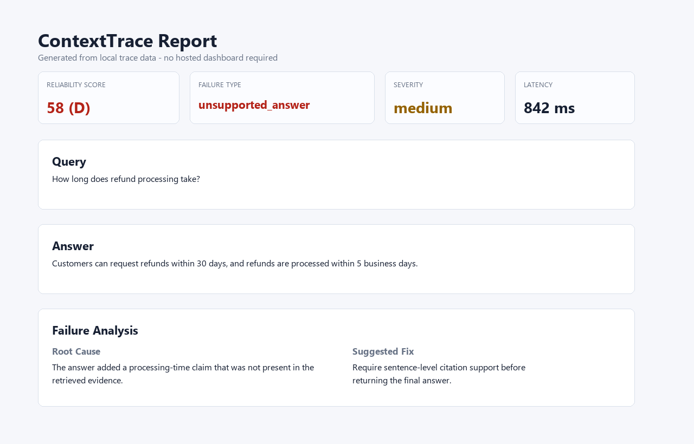

# ContextTrace: Local-first RAG reliability SDK

[](https://github.com/samarth1412/Context-Trace/actions)
[](https://pypi.org/project/contexttrace/)
[](packages/contexttrace/pyproject.toml)
[](LICENSE)

**Debug RAG failures before users find them.**

ContextTrace is a local-first SDK and CLI for evaluating existing RAG and AI agent systems. Instrument your pipeline with the SDK or point the CLI at your RAG API, then get local traces, citation support checks, failure labels, root-cause diagnosis, and HTML reports. No dashboard service is required.

## Core Idea

Most evaluation tools tell you a score. ContextTrace shows the failure path:

```text
retrieved weak evidence
  -> selected incomplete context
  -> generated unsupported claim
  -> citation mismatch
  -> suggested fix
```

The goal is not just to say a RAG answer failed. The goal is to show where the evidence chain broke and what to try next.

## Why ContextTrace?

RAG systems often fail in ways that look plausible:

- the retriever misses the source that answers the question
- selected context drops the most relevant chunk
- citations point to evidence that does not support the claim
- archived or conflicting sources leak into answers
- agents reuse stale memory or irrelevant tool output

ContextTrace records the evidence path and turns it into a local report with concrete fixes to try next.

## What ContextTrace Catches

| Failure | Example |
| --- | --- |
| `retrieval_miss` | The refund policy exists, but the retriever only returns shipping terms. |
| `citation_mismatch` | The answer cites `refund_policy.md`, but the cited chunk only explains exchanges. |
| `unsupported_answer` | The answer claims "refunds are processed in 2 days" when no source says that. |
| `should_have_abstained` | The user asks about a loyalty exception that is not in the documents, but the model invents one. |
| `conflicting_sources` | Current policy says 30 days, while an archived memo says 14 days. |
| `stale_memory_used` | An agent uses an old customer-policy memory instead of the latest retrieved context. |

## Requirements

- Python 3.8+
- Optional LLM judge provider API key
- No hosted backend required

## Quickstart

```bash
pip install contexttrace
contexttrace init
contexttrace demo --dataset refund_policy
contexttrace report --last --open
```

This creates `.contexttrace/contexttrace.db`, runs a synthetic demo RAG flow, evaluates the traces, and writes an HTML report under `.contexttrace/reports/`.

## Claim-Level Evidence Verification

Citations are not always grounding.

ContextTrace can verify whether each generated claim is actually supported by retrieved evidence:

```bash
contexttrace verify-demo unsupported_claim --report
```

It checks:

- supported claims
- partially supported claims
- unsupported claims
- citation mismatches
- contradicted or unverifiable claims
- whether the model should have abstained

Instead of only saying an answer is low quality, ContextTrace shows where the evidence chain broke.

The bundled demos work after `pip install contexttrace`. If you are using a cloned repository, the same golden traces are also available as JSON files under `examples/verify/`.

Short input example:

```json
{
  "query": "How long does refund processing take?",
  "answer": "Refunds are processed within 5 business days.",
  "contexts": [
    {
      "id": "policy_2026",
      "text": "Customers may request refunds within 30 days of purchase."
    }
  ]
}
```

Short output example:

```json
{
  "summary": {
    "total_claims": 1,
    "supported": 0,
    "unsupported": 1,
    "support_rate": 0.0,
    "unsupported_claim_rate": 1.0,
    "failure_type": "should_have_abstained",
    "failure_types": ["should_have_abstained", "unsupported_answer"],
    "should_abstain": true,
    "suggested_fix": "Add an abstention rule: when retrieved contexts do not support the requested fact, say the information is unavailable instead of generating a factual answer."
  }
}
```

## Development Install

For local development from source:

```bash
git clone https://github.com/samarth1412/Context-Trace.git
cd Context-Trace
pip install -e packages/contexttrace
```

## Example Output

```text
$ contexttrace demo --dataset refund_policy

Dataset              refund_policy
Questions tested     10
Reliability score    72/100
Failure rate         0.30
Citation support     0.81
Top failures         citation_mismatch: 2
                     unsupported_answer: 1
                     retrieval_miss: 1
Worst trace          trace_8f31c2
Root cause           The answer cited the exchange policy, but the claim was
                     about refund processing time.
Suggested fix        Add sentence-level citation selection before returning
                     the final answer.
Report               .contexttrace/reports/refund_policy_demo.html
```

## Canonical Demo Story

Use this failure pattern when explaining ContextTrace:

| Step | Value |
| --- | --- |
| Query | How long does refund processing take? |
| Source chunk | Customers may request a refund within 30 days of purchase. |
| Bad RAG answer | Customers can request refunds within 30 days, and refunds are processed within 5 business days. |
| Claim 1 verdict | `directly_supported` |
| Claim 2 verdict | `unsupported` |
| Failure type | `unsupported_answer` |
| Root cause | The answer added a processing-time claim that was not present in the retrieved evidence. |
| Suggested fix | Require sentence-level citation support before returning the final answer. |

## SDK Usage

```python
from contexttrace import ContextTrace

ct = ContextTrace(project="support-rag")

with ct.trace(query="What is the refund policy?") as trace:
    chunks = retriever.search("What is the refund policy?")
    trace.log_retrieval(chunks)
    trace.log_context(chunks[:5])

    answer = llm.generate("What is the refund policy?", chunks[:5])
    trace.log_answer(answer, usage={"total_tokens": 1200})
    trace.log_citations([
        {"claim": "Refunds are available within 30 days.", "source_chunk_id": "chunk_12"}
    ])

    result = trace.evaluate()
    print(result["failure"]["failure_type"])
    print(result["failure"]["suggested_fix"])
```

No backend server is required unless you explicitly configure one.

## Evaluate Your Own RAG API

Evaluate an existing RAG endpoint without adding SDK code:

```bash
contexttrace eval \
  --dataset evals/questions.json \
  --endpoint http://localhost:8000/query \
  --method POST \
  --input-key question \
  --answer-path $.answer \
  --contexts-path $.contexts \
  --citations-path $.citations \
  --fail-on "failure_rate>0.25" \
  --fail-on "citation_support<0.80"
```

Expected endpoint response shape:

```json
{
  "answer": "Refunds are available within 30 days.",
  "contexts": [
    {
      "id": "refund_policy_1",
      "text": "Customers may request a refund within 30 days of purchase.",
      "source": "refund_policy.md"
    }
  ],
  "citations": [
    {
      "claim": "Refunds are available within 30 days.",
      "source_chunk_id": "refund_policy_1"
    }
  ]
}
```

ContextTrace calls your endpoint, maps the JSON response, creates local traces, evaluates them, and writes a report.

## Verification CLI Details

ContextTrace verifies whether each generated claim is actually supported by retrieved evidence. Instead of only showing a trace or a score, it tells you where the evidence chain broke: unsupported claim, citation mismatch, insufficient context, or should-have-abstained.

This solves a common RAG failure: an answer can look cited even when the cited source does not actually support the claim. `contexttrace verify` checks a portable JSON artifact that most RAG systems can already emit:

```text
query -> retrieved contexts -> answer -> claims -> citations -> support verdicts
```

Install ContextTrace:

```bash
pip install contexttrace
```

Example input:

```json
{
  "query": "How long does refund processing take?",
  "answer": "Refunds are processed within 5 business days.",
  "contexts": [
    {
      "id": "policy_2026",
      "text": "Customers may request refunds within 30 days of purchase.",
      "metadata": {
        "source": "refund_policy.pdf",
        "page": 2
      }
    }
  ],
  "metadata": {
    "model": "gpt-4.1",
    "retriever": "hybrid_top_5"
  }
}
```

CLI usage:

```bash
contexttrace verify trace.json
contexttrace verify trace.json --json
contexttrace verify trace.json --report
contexttrace verify trace.json --report --out reports/example.html
contexttrace verify trace.json --mode semantic
contexttrace verify trace.json --fail-on unsupported --fail-on citation_mismatch
contexttrace verify-benchmark --mode semantic
```

Run a bundled demo:

```bash
contexttrace verify-demo unsupported_claim --report
```

Run a repo-relative JSON example from a source checkout:

```bash
contexttrace verify examples/verify/unsupported_claim.json --report
```

Example JSON output:

```json
{
  "query": "How long does refund processing take?",
  "answer": "Refunds are processed within 5 business days.",
  "summary": {
    "total_claims": 1,
    "supported": 0,
    "unsupported": 1,
    "contradicted": 0,
    "unverifiable": 0,
    "support_rate": 0.0,
    "unsupported_claim_rate": 1.0,
    "citation_mismatches": 1,
    "should_abstain": true,
    "failure_type": "should_have_abstained",
    "failure_types": ["should_have_abstained", "unsupported_answer"],
    "suggested_fix": "Add an abstention rule: when retrieved contexts do not support the requested fact, say the information is unavailable instead of generating a factual answer."
  },
  "claims": [
    {
      "claim_id": "claim_1",
      "claim": "Refunds are processed within 5 business days.",
      "verdict": "unsupported",
      "confidence": 0.819,
      "best_context_id": "policy_2026",
      "best_context_text": "Customers may request refunds within 30 days of purchase.",
      "best_score": 0.181,
      "evidence": "Customers may request refunds within 30 days of purchase.",
      "matched_terms": ["refunds", "days"],
      "reason": "No retrieved context has enough lexical overlap to support the claim.",
      "citation_status": "claim_has_no_citation",
      "citation_source_id": null
    }
  ],
  "abstention": {
    "should_abstain": true,
    "reason": "The answer contains factual claims, but most important claims are unsupported or contradicted by the retrieved contexts."
  },
  "diagnostics": {
    "failure_type": "should_have_abstained",
    "failure_types": ["should_have_abstained", "unsupported_answer"],
    "suggested_fix": "Add an abstention rule: when retrieved contexts do not support the requested fact, say the information is unavailable instead of generating a factual answer."
  },
  "metadata": {
    "model": "gpt-4.1",
    "retriever": "hybrid_top_5"
  }
}
```

The local HTML report is self-contained and includes a reliability summary, claim support overview, unsupported claims, root-cause diagnosis, citation mismatches, retrieved contexts, developer-friendly failure explanations, and a raw JSON summary. Report placeholder: `contexttrace verify-demo unsupported_claim --report --out reports/example.html`.

Verification output also includes evidence span metadata (`start_char`, `end_char`, and `span_hash`), multiple supporting spans when a claim needs evidence from more than one retrieved passage, typed required/matched/missing facts, and claim-level root causes so partial support is easier to debug.

Root-cause labels:

- `no_failure_detected`
- `retrieval_miss`
- `answer_overreach`
- `partial_context_support`
- `wrong_source_cited`
- `missing_cited_source`
- `conflicting_contexts`
- `stale_context`
- `insufficient_context`
- `should_have_abstained`

Verdict meanings:

- `supported`: strong local lexical evidence overlap with a retrieved context.
- `partially_supported`: the context supports some terms or details, but not the complete claim.
- `unsupported`: no retrieved context has enough evidence for the claim.
- `unverifiable`: some evidence overlaps, but it is weak or ambiguous.
- `contradicted`: conservative detection found explicit negation or conflicting numeric/date values.

CI failure gates:

- `unsupported`
- `partial_support`
- `citation_mismatch`
- `should_abstain`
- `contradicted`
- `unverifiable`
- `no_citation`
- `any_failure`

Verification modes:

- `lexical`: default deterministic token and phrase overlap.
- `semantic`: local paraphrase-aware normalization for common RAG support cases such as refund vs money back, order number vs order ID, and numeric words vs digits.

Run the bundled precision/recall benchmark:

```bash
contexttrace verify-benchmark --mode lexical
contexttrace verify-benchmark --mode semantic --json
contexttrace verify-benchmark --mode semantic --report
contexttrace verify-benchmark --case-set external --mode semantic --report
contexttrace verify-benchmark --case-set all --mode semantic
```

The default benchmark uses 32 real ContextTrace repository docs and release artifacts, not synthetic refund-policy fixtures. `--case-set external` runs public OSS documentation and GitHub issue cases from Qdrant, Chroma, Haystack, and LangChain. `--case-set all` runs both packs together. The benchmark reports exact-match rate, verdict match rate, citation match rate, abstention match rate, and per-label precision, recall, and F1. The HTML report includes misses to inspect so the verifier can be improved against concrete product-doc failures.

Citation statuses:

- `citation_ok`
- `cited_source_missing`
- `cited_source_does_not_support_claim`
- `claim_supported_by_different_source`
- `claim_has_no_citation`

Limitations:

- v0.3.0 uses local lexical heuristics by default.
- Semantic mode uses local normalization, not embedding or LLM reasoning.
- Optional embedding or LLM-judge support can come later.
- Contradiction detection is conservative.
- Claim extraction is rule-based initially.
- This is best for debugging and is not a replacement for human review in high-stakes domains.

## How ContextTrace Is Different

ContextTrace complements existing evaluation and observability tools. It focuses on local, RAG-specific diagnosis rather than replacing broader tracing or benchmark frameworks.

| Tool Category | Primary Strength | ContextTrace Focus |
| --- | --- | --- |
| RAGAS / DeepEval | Scoring and eval metrics | Local evidence traces, citation support, failure taxonomy, suggested fixes |
| LangSmith | General LLM app tracing | RAG-specific root-cause diagnosis for retrieval, context, citations, and agents |
| Phoenix / TruLens | Observability and evaluation | Local-first reports with claim-to-source checks and actionable failure labels |
| ContextTrace | RAG and agent reliability debugging | Local SQLite traces, BYO endpoint eval, citation verification, failure diagnosis, CI regression checks |

## When Should You Use ContextTrace?

Use ContextTrace when:

- you already built a RAG app and need to debug quality issues
- you want to test whether citations actually support answer claims
- you need local reports for private documents or internal policies
- you want CI regression checks for retrieval or prompt changes
- you want root-cause diagnosis instead of only aggregate scores
- you want a lightweight way to inspect agent tool, memory, and retrieval events

## Failure Taxonomy

RAG failure labels include:

- `retrieval_miss`
- `low_relevance_context`
- `citation_mismatch`
- `unsupported_answer`
- `contradicted_answer`
- `conflicting_sources`
- `bad_chunking`
- `over_compression`
- `should_have_abstained`
- `query_needs_decomposition`

Agent-oriented labels include:

- `wrong_tool_used`
- `tool_error`
- `stale_memory_used`
- `missing_memory`
- `excessive_tool_calls`
- `agent_loop_detected`

Each report includes severity, root cause, and suggested fix.

## Local Reports

Reports include:

- executive summary and reliability score
- query, answer, retrieved chunks, and selected context
- citation verdicts and unsupported claims
- failure breakdown and suggested fixes
- token, cost, and latency metrics when logged
- strategy comparison or eval summary when available

Open recent traces locally:

```bash
contexttrace viewer
```

The local viewer reads from `.contexttrace/contexttrace.db` and serves pages at `http://localhost:8765`.

## Example Report



## CLI Commands

```bash
contexttrace init
contexttrace status
contexttrace demo --dataset refund_policy
contexttrace traces list
contexttrace traces show <trace_id>
contexttrace verify-demo unsupported_claim --report
contexttrace verify examples/verify/unsupported_claim.json --report
contexttrace report --last --open
contexttrace viewer
contexttrace benchmark --dataset datasets/demo/refund_policy
contexttrace eval --dataset evals/questions.json --endpoint http://localhost:8000/query
contexttrace doctor
```

## Integrations

- LangChain callback handler
- LlamaIndex callback handler
- FastAPI middleware and endpoint evaluation
- LangGraph beta tracer
- OpenTelemetry export

## Privacy And Local Mode

Local mode is the default. Trace data is written to:

```text
.contexttrace/contexttrace.db
```

ContextTrace does not require a hosted dashboard. It makes no network calls unless you configure an LLM judge provider or run endpoint evaluation against a RAG API you provide.

Privacy controls:

- `local_only: true`
- `log_chunk_text: false`
- `log_answer_text: false`
- `storage_path: /custom/contexttrace.db`

## Regression Testing And GitHub Action

Run local regression checks:

```bash
contexttrace benchmark \
  --dataset datasets/demo/refund_policy \
  --fail-on "failure_rate>0.25" \
  --fail-on "citation_support<0.80"
```

Use the bundled composite action:

```yaml
- uses: ./.github/actions/contexttrace-rag-eval
  with:
    dataset_path: datasets/demo/refund_policy
    fail_on: |
      failure_rate>0.25
      citation_support<0.80
```

The action uploads the HTML report and writes a GitHub markdown summary.

## Architecture

```text
User RAG app / agent / endpoint
  -> SDK / CLI / integrations
  -> local SQLite trace store
  -> citation verifier + failure analyzer
  -> local HTML report / viewer
```

Repository layout:

```text
packages/contexttrace   Python SDK, CLI, integrations, local SQLite store
apps/api                Optional FastAPI API mode
datasets/demo           Synthetic public demo datasets
benchmarks              Deterministic benchmark helpers
docs                    Developer documentation
examples                SDK and endpoint examples
```

## Limitations

- ContextTrace is diagnostic, not a guarantee of correctness.
- LLM-judge outputs should be reviewed for high-stakes workflows.
- ContextTrace complements existing eval and observability tools; it does not replace them.

## Try It

```bash
contexttrace demo --dataset refund_policy
contexttrace eval --dataset evals/questions.json --endpoint http://localhost:8000/query
contexttrace report --last --open
```

Try the demo, run it on your RAG endpoint, then open the report.

## Contributing

See [CONTRIBUTING.md](CONTRIBUTING.md). Security reports should follow [SECURITY.md](SECURITY.md).
