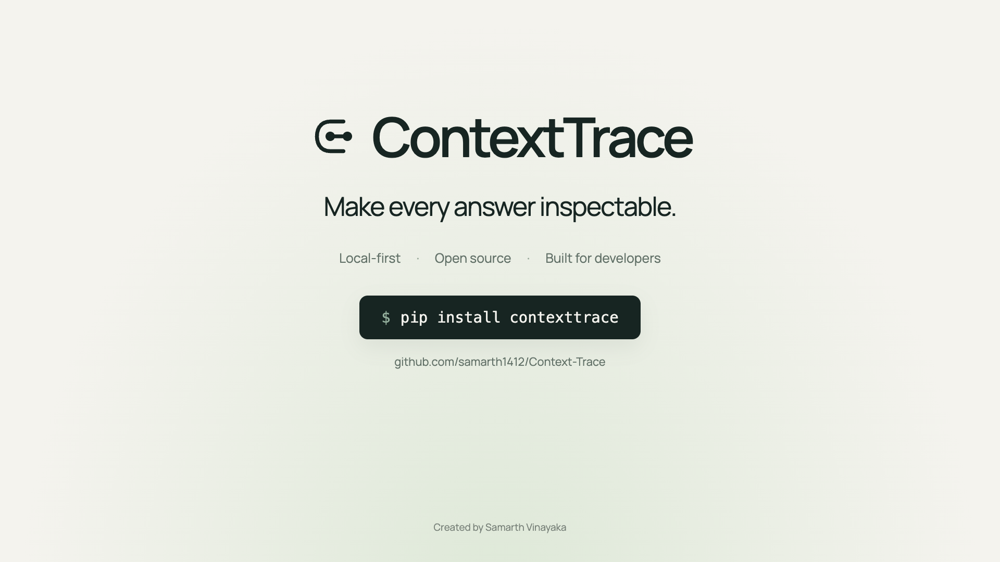

# Reproducible demo videos

## ContextTrace in 32 seconds

[](https://github.com/user-attachments/assets/304681e1-2e00-45cb-afd0-0c27c6400cce)

[Watch the film](https://github.com/user-attachments/assets/304681e1-2e00-45cb-afd0-0c27c6400cce)
· [Captions](../../../media/contexttrace-demo/captions.vtt)
· [Editable Remotion source](../../../media/contexttrace-demo)

32 seconds, 1080p, with an original ambient soundtrack. The illustrated fictional
runbook case shows a contradicted answer, a corrected trace, and a passing
regression check. The video is hosted as a GitHub attachment; only its poster
and editable source are tracked in Git. This is not a recording of a shipped GUI.

## Animated terminal walkthroughs

These two silent animated terminal demos are generated from scripted frames and ship with WebVTT captions. Each is 1280×720, 13.6 seconds, loops continuously, and uses the same public fictional cases as the investigation runner.

| Demo | Video | Captions | Story |
| --- | --- | --- | --- |
| Stale source to regression | [GIF](stale-source-to-regression.gif) | [WebVTT](stale-source-to-regression.vtt) | Supported answer → stale source → canonical repair |
| Citation failure to CI | [GIF](citation-failure-to-ci.gif) | [WebVTT](citation-failure-to-ci.vtt) | Supported claim → wrong citation → six-case gate |

Rebuild them after installing the development dependencies:

```bash
python -m pip install -r docs/assets/demos/requirements.txt
python scripts/build_growth_assets.py
```

The GIF format makes the clips playable in GitHub, package documentation, and social posts without an external host. Captions contain the complete narration for accessibility and adaptation.
